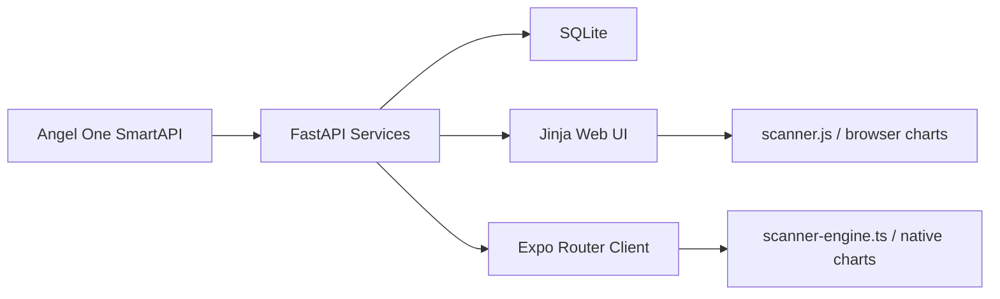
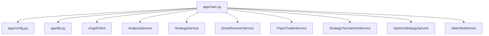
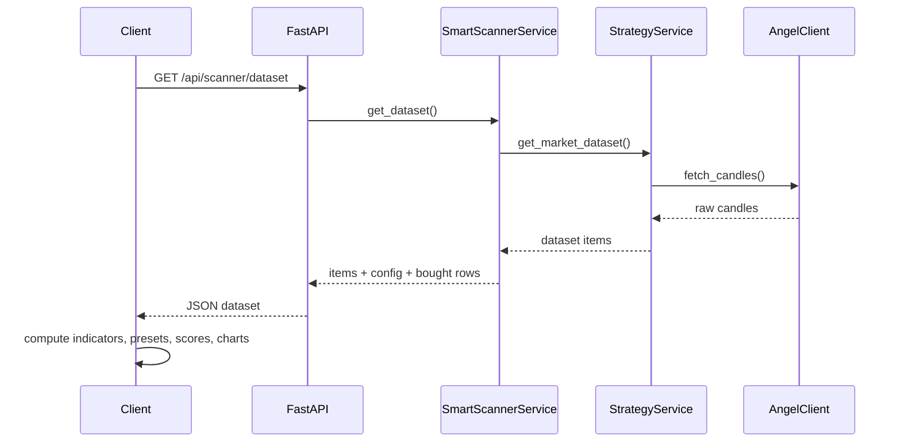

# Architecture

## Overview

The app is a hybrid trading workspace with one backend and two presentation layers:

- FastAPI + SQLite backend
- Jinja/browser web UI
- shared Expo Router client for web, Android, and iOS

The central design rule is that raw market data comes from the backend, while the interactive analysis layer lives on the frontend.

## System Diagram

## Backend Composition

## Scanner Architecture

### Why it is split this way

The scanner is expected to grow quickly. If every new indicator or filter required backend changes and heavier API responses, iteration would slow down. The current flow keeps extension work mostly on the client.

### Dataset path

### Web scanner

The browser scanner in `app/static/scanner.js` is optimized for:

- large-table filtering
- canvas-based expanded charts
- local column toggles and presets
- CSV export and symbol copy workflows

### Expo scanner

The shared client scanner in `client/lib/scanner-engine.ts` is optimized for:

- reusable scanner row generation on web and native
- device-side chart series calculation
- keeping heavy ranking/filter logic local after dataset fetch

## Timeframe Handling

Intervals supported today:

- `FIVE_MINUTE`
- `FIFTEEN_MINUTE`
- `ONE_HOUR`
- `ONE_DAY`
- `ONE_WEEK`
- `ONE_MONTH`

Weekly and monthly modes are derived from daily candles when broker-native long-interval support is not used directly. That keeps long-term scans consistent across web and mobile.

## Persistence Model

SQLite is the durable local store for:

- user watchlist state
- scanner config
- bought monitor rows
- paper account state
- paper and tournament trade history
- cached scan results

This makes the app easy to run daily on a laptop without requiring an external database server.

## Mobile and Web Compatibility

The shared Expo app is the portable client layer. The browser web pages remain useful for richer desktop workflows, especially the scanner table. The two client surfaces share the same backend and follow the same rule:

- fetch raw data once
- analyze and visualize locally on the user device

## Operational Notes

- APScheduler is used for backend interval jobs such as automation, paper auto-trading, and tournaments
- native dependency fixes for Expo are kept in `client/patches/`
- the cleanup script is the supported way to prune old rows and temporary files

## Extension Points

When adding new features, start with these questions:

1. Is this a raw data need or a presentation/analysis need?
2. Can the existing dataset support it?
3. Should the new logic live in `scanner-engine.ts`, `scanner.js`, or a backend service?
4. Does the same feature need parity across web and mobile?

That framing helps keep the architecture consistent over time.
